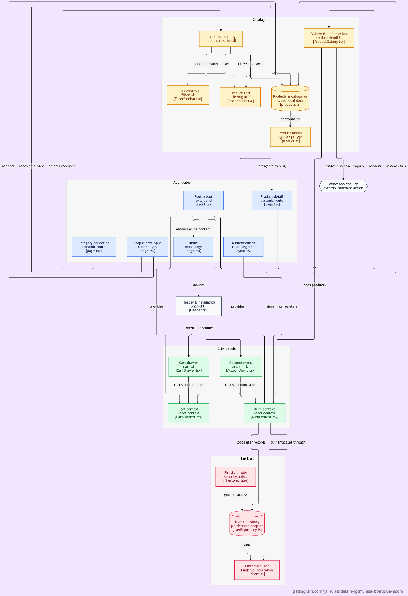

# NISA BOUTIQUE &bull; E-Commerce Storefront & Admin Portal

[](https://nextjs.org/)
[](https://react.dev/)
[](https://www.typescriptlang.org/)
[](https://tailwindcss.com/)
[](https://firebase.google.com/)
[](https://nisaboutique-ecom.netlify.app/)

> **NISA BOUTIQUE &bull; EST. 2008 &bull; Kolkata, India**  
> Physical storefront located at Karl Marx Sarani, Khidirpur, Kolkata, West Bengal. Specializing in authentic Pakistani suits, bespoke handwork ensembles (zardozi, tilla, dabka), and fine luxury fabrics.

---

## Quick Links

- **Live Website:** [https://nisaboutique-ecom.netlify.app](https://nisaboutique-ecom.netlify.app/)
- **GitHub Repository:** [https://github.com/jainulabidalam-lgtm/Nisa-Boutique-Ecom](https://github.com/jainulabidalam-lgtm/Nisa-Boutique-Ecom)
- **Physical Boutique:** 49/5/H/213/1 Karl Marx Sarani, Baghkothi Mod, Babubazar, Khidirpur, Kolkata - 700023, West Bengal, India

---

## Table of Contents

1. [Project Overview](#project-overview)
2. [Key Features](#key-features)
3. [Technology Stack](#technology-stack)
4. [Architecture & Data Strategy](#architecture--data-strategy)
5. [Shopping Model & WhatsApp Ordering](#shopping-model--whatsapp-ordering)
6. [Payment & Checkout Status](#payment--checkout-status)
7. [Repository Structure](#repository-structure)
8. [Getting Started (Windows PowerShell & npm)](#getting-started-windows-powershell--npm)
9. [Environment Variables](#environment-variables)
10. [Firebase Setup & Security Rules](#firebase-setup--security-rules)
11. [Cloudinary Integration](#cloudinary-integration)
12. [Available Scripts](#available-scripts)
13. [Production Build & Deployment](#production-build--deployment)
14. [Security Considerations](#security-considerations)
15. [Known Limitations](#known-limitations)
16. [Credits & Heritage](#credits--heritage)

---

## Project Overview

**NISA Boutique E-Commerce** is a web storefront and administrative catalogue management platform designed for a heritage women's fashion boutique in Kolkata. Established in 2008, the boutique has served patrons with an authentic physical retail experience. This web platform digitizes the boutique's catalogue, enabling patrons worldwide to explore collections, check availability, view high-resolution garments, and order directly through a personalized WhatsApp concierge desk.

The application is built with **Next.js (App Router)** as a **Static HTML Export (`output: "export"`)** paired with client-side hydration. Dynamic features such as live catalogue updates, administrative product management, user authentication, and Cloudinary media uploads operate client-side against **Google Cloud Firestore** and **Firebase Authentication**.

---

## Key Features

### Customer Storefront
- **Curated Collections:** Browse Pakistani suits, handwork ensembles, cotton lawn, and exclusive boutique pieces.
- **Product Filtering & Sorting:** Filter by category, available sizes (`XS`, `S`, `M`, `L`, `XL`, `Unstitched`, `Custom`), price ranges, and real-time in-stock availability; sort by featured, newest, or price.
- **Rich Product Views:** Multi-image gallery with thumbnail selection, garment details, fabric composition, care instructions, and related recommendations.
- **WhatsApp Concierge Ordering:** Single-click order inquiries with pre-formatted, URL-encoded messages detailing item name, category, selected size, price, canonical image URL, and product page link.
- **Responsive Boutique Aesthetic:** Editorial typography, warm neutral and gold accents, fluid mobile navigation drawers, and accessible layout semantics.
- **Optional Cart Drawer:** Client-side sliding bag supporting quantity management and multi-item WhatsApp inquiry dispatch (controlled by feature flag).

### Authentication & Account Management
- **Firebase Authentication:** Google Sign-In via popup and email/password credentials.
- **Firestore User Profiles:** Automatic creation of customer records (`users/{uid}`) synchronized on first login.
- **Role-Based Authorization:** Separate customer and admin permission profiles.

### Administrative Portal (`/admin`)
- **Protected Admin Guard:** Client-side route protection coupled with strict database-level Firestore security rules.
- **Catalogue Dashboard:** Real-time metrics on total items, active vs. unavailable pieces, category counts, and featured garments.
- **Product Management:** Full CRUD operations—create new products, update descriptions/prices/sizes/categories, toggle live availability, and delete records.
- **Direct Cloudinary Image Uploader:** Multi-file drag-and-drop client uploads with format and file size validation (max 5 MB; JPG, PNG, WebP) utilizing an unsigned Cloudinary upload preset.
- **Slug Collision Detection:** Real-time Firestore validation ensuring product URL slugs remain unique.

---

## Technology Stack

| Layer | Technology | Details |
| :--- | :--- | :--- |
| **Framework** | Next.js 16.3.4 (App Router) | Static export mode (`output: 'export'`, `trailingSlash: true`) |
| **UI Library** | React 19.2.8 & React-DOM 19.2.8 | Server & Client Components, React Context state |
| **Language** | TypeScript 5 | Strict type safety for products, users, filters, and repository calls |
| **Styling** | Tailwind CSS v4 | Integrated via `@tailwindcss/postcss` with custom theme tokens |
| **Authentication** | Firebase Auth v12.19.0 | Google Auth Provider (`signInWithPopup`) & Email/Password |
| **Database** | Google Cloud Firestore | Document collections for products and users |
| **Media Storage** | Cloudinary REST API | Direct unsigned client-side uploads (no server secret exposed) |
| **Hosting & CDN** | Netlify | Static asset distribution with custom SPA redirect rules |
| **Linting** | ESLint 9 (`eslint-config-next`) | Code style and Next.js best-practice enforcement |

---

## Architecture & Data Strategy



*This diagram illustrates the storefront, catalogue, app routes, client state, Firebase integration, and WhatsApp enquiry flow.*

```
                                +---------------------------------------------+
                                |             Next.js App Router              |
                                |     (Static HTML Export / Netlify CDN)      |
                                +----------------------+----------------------+
                                                       |
                             +-------------------------+-------------------------+
                             |                                                   |
                             v                                                   v
                +-------------------------+                         +-------------------------+
                |    Static Catalogue     |                         |  Client-Side Hydration  |
                |  (SSG build via         |                         |  (React Context / SWR)  |
                |   src/data/products.ts) |                         +------------+------------+
                +------------+------------+                                      |
                             |                                                   |
                             +-------------------+  +----------------------------+
                                                 |  |
                                                 v  v
                                      +-------------------------+
                                      |   mergeProducts()       |
                                      |  (Firestore overrides   |
                                      |   static fallbacks)     |
                                      +------------+------------+
                                                   |
                             +---------------------+---------------------+
                             |                                           |
                             v                                           v
                +-------------------------+                 +-------------------------+
                |     Cloud Firestore     |                 |  Cloudinary REST API    |
                |  - /products/{id}       |                 |  (Direct unsigned image |
                |  - /users/{uid}         |                 |   uploads from browser) |
                +-------------------------+                 +-------------------------+
```

### Hybrid SSG + Live Client Fallback
1. **Static Build Phase (`npm run build`):**
   - Next.js pre-renders known product routes (`/product/[slug]`) and collection pages based on static fallback data (`src/data/products.ts`) and any items currently available in Firestore.
   - Generates static HTML, CSS, and client JavaScript bundles into the `out/` directory.
2. **Runtime Client Phase (Netlify):**
   - When a visitor navigates to a newly added product whose HTML was not pre-rendered during the last build, Netlify's rewrite rule (`/product/* -> /index.html 200`) serves the client SPA shell.
   - `ProductDetailView` queries Firestore directly via `fetchProductBySlug(slug)`.
   - The catalogue automatically merges Firestore data with static seeds (`mergeProducts`), with Firestore documents taking precedence.

---

## Shopping Model & WhatsApp Ordering

The storefront is configured by default in an **Inquiry-Only Concierge Model**. Rather than a self-checkout flow, customers connect directly with boutique stylists in Kolkata.

### How WhatsApp Ordering Operates
1. **Selection:** A customer selects their garment and preferred size (`XS` to `Custom`).
2. **Payload Formulation (`src/lib/utils/whatsapp.ts`):** The application constructs a clean, standardized plain-text inquiry message containing:
   - Garment name and category
   - Listed price (INR ₹)
   - Chosen size specification
   - Fully qualified, canonical image URL (resolved against `NEXT_PUBLIC_SITE_URL`)
   - Fully qualified product link for stylist reference
3. **Dispatch:** The user is redirected to `https://wa.me/<PHONE>?text=<ENCODED_MESSAGE>`, opening WhatsApp Web or the WhatsApp mobile app.
4. **Environment Variable:**
   - `NEXT_PUBLIC_WHATSAPP_NUMBER`: Defines the destination boutique phone number in international format without symbols (e.g., `919088546334`). If omitted, the codebase defaults to the registered boutique contact.

---

## Payment & Checkout Status

> [!IMPORTANT]
> **Online checkout and payment processing are intentionally disabled in the current code.**

Verification from repository inspection:
1. `src/lib/config/storeConfig.ts` sets `ENABLE_CART_AND_CHECKOUT` to `false` by default, activating `STORE_MODE = "inquiry-only"`.
2. In `src/components/layout/CartDrawer.tsx`, the "Proceed to Checkout" button explicitly triggers an alert:  
   `"Frontend Preview: Checkout and payment integration will be configured in the next phase."`
3. No payment gateway SDK (Razorpay, Stripe, Cashfree, or PayPal) is installed in `package.json`.
4. No backend payment processing webhooks or server routes exist.
5. All transactions and custom stitching requirements are finalized manually through the WhatsApp concierge or at the physical Kolkata store.

---

## Repository Structure

```
nisa-boutique/
├── .env.example                     # Sample environment variable declarations
├── .gitignore                       # Git ignore rules for node_modules, .next, out
├── eslint.config.mjs                # ESLint configuration
├── firebase.json                    # Firebase CLI hosting and Firestore rules config
├── firestore.rules                  # Production Cloud Firestore security rules
├── netlify.toml                     # Netlify build commands and SPA rewrite rules
├── next.config.ts                   # Next.js configuration (static export, images)
├── package.json                     # Project dependencies, scripts, and metadata
├── postcss.config.mjs               # PostCSS configuration for Tailwind CSS v4
├── tsconfig.json                    # TypeScript compiler configuration
├── public/                          # Static assets and category vector graphics
│   ├── favicon.ico
│   └── images/
│       ├── categories/              # Category SVG cards
│       ├── hero/                    # Hero banners
│       └── products/                # Seed product imagery
└── src/
    ├── app/                         # Next.js App Router pages
    │   ├── (auth)/                  # Auth route group
    │   │   ├── login/page.tsx       # Customer and admin sign-in
    │   │   └── signup/page.tsx      # Customer account registration
    │   ├── about/page.tsx           # Boutique heritage & Kolkata store narrative
    │   ├── admin/                   # Administrative portal
    │   │   ├── layout.tsx           # Admin layout with metadata robot block
    │   │   ├── page.tsx             # Admin overview dashboard & KPI stats
    │   │   └── products/
    │   │       ├── page.tsx         # Product catalogue table with delete/toggle
    │   │       ├── new/page.tsx     # Product creation form with Cloudinary upload
    │   │       └── edit/page.tsx    # Product edit form with preloaded data
    │   ├── catalogue/page.tsx       # Redirect / alias to main shop
    │   ├── collections/[category]/  # Category-filtered catalogue views
    │   ├── product/[slug]/page.tsx  # Dynamic product page with generateStaticParams
    │   ├── shop/page.tsx            # Full boutique catalog with interactive filters
    │   ├── globals.css              # Global styles and font definitions
    │   ├── layout.tsx               # Root HTML layout, Header, Footer, CartDrawer
    │   └── page.tsx                 # Homepage with hero, categories, trust highlights
    ├── components/
    │   ├── admin/                   # AdminGuard, ProductListTable
    │   ├── collections/             # CollectionCatalog, FilterSidebar, SortDropdown
    │   ├── home/                    # HeroSection, CategorySection, EstablishedSection
    │   ├── layout/                  # Header, Footer, CartDrawer, AccountMenu, BrandLogo
    │   ├── navigation/              # MobileNavDrawer, Breadcrumbs
    │   ├── products/                # ProductDetailView, ProductGallery, PurchaseBox
    │   ├── store/                   # StoreInfoSection, physical store details
    │   └── ui/                      # Button, Badge, Modal, Input design tokens
    ├── context/
    │   ├── AuthContext.tsx          # Firebase Auth listener & user profile provider
    │   └── CartContext.tsx          # In-memory shopping bag state provider
    ├── data/
    │   ├── categories.ts            # Category taxonomies and copy
    │   └── products.ts              # Seed product catalog and mergeProducts helper
    ├── lib/
    │   ├── cloudinary/
    │   │   └── uploadRepository.ts  # Browser-to-Cloudinary direct upload via fetch
    │   ├── config/
    │   │   └── storeConfig.ts       # Store modes, origins, and cart feature flags
    │   ├── firebase/
    │   │   ├── client.ts            # Firebase app, auth, and firestore singletons
    │   │   ├── productRepository.ts # Firestore CRUD operations for products
    │   │   ├── sanitize.ts          # Strips undefined fields before Firestore writes
    │   │   └── userRepository.ts    # Firestore user document synchronization
    │   └── utils/
    │       ├── currency.ts          # INR currency formatter (Intl.NumberFormat)
    │       └── whatsapp.ts          # WhatsApp URL generator and message formatter
    └── types/
        ├── product.ts               # Product, Category, Filter, and Sort interfaces
        └── user.ts                  # NisaUser profile interface
```

---

## Getting Started (Windows PowerShell & npm)

### Prerequisites
- **Node.js:** v20.x or higher installed ([Download Node.js](https://nodejs.org/))
- **npm:** v10.x or higher (bundled with Node.js)
- **Git:** Installed on your system

### Step-by-Step Installation

1. **Clone the Repository:**
   ```powershell
   git clone https://github.com/jainulabidalam-lgtm/Nisa-Boutique-Ecom.git
   Set-Location -Path .\Nisa-Boutique-Ecom
   ```

2. **Navigate to App Directory (if cloned inside workspace subdirectory):**
   ```powershell
   # If working directly inside nisa-boutique directory:
   Set-Location -Path .\nisa-boutique
   ```

3. **Install Dependencies:**
   ```powershell
   npm install
   ```

4. **Configure Environment Variables:**
   Create a local environment file by copying `.env.example`:
   ```powershell
   Copy-Item -Path .env.example -Destination .env.local
   ```
   Open `.env.local` in your editor and fill in your Firebase and Cloudinary credentials (see [Environment Variables](#environment-variables)).

5. **Start the Development Server:**
   ```powershell
   npm run dev
   ```
   Open [http://localhost:3000](http://localhost:3000) in your browser.

---

## Environment Variables

All environment variables used by the application are prefixed with `NEXT_PUBLIC_` because the application operates as a static export where all API calls originate from the client browser.

Create a `.env.local` file with the following variables:

```ini
# ==============================================================================
# FIREBASE WEB CONFIGURATION (Obtained from Firebase Project Settings)
# ==============================================================================
NEXT_PUBLIC_FIREBASE_API_KEY="your-firebase-api-key"
NEXT_PUBLIC_FIREBASE_AUTH_DOMAIN="your-project-id.firebaseapp.com"
NEXT_PUBLIC_FIREBASE_PROJECT_ID="your-project-id"
NEXT_PUBLIC_FIREBASE_STORAGE_BUCKET="your-project-id.firebasestorage.app"
NEXT_PUBLIC_FIREBASE_MESSAGING_SENDER_ID="your-messaging-sender-id"
NEXT_PUBLIC_FIREBASE_APP_ID="your-app-id"

# ==============================================================================
# CLOUDINARY MEDIA STORAGE (Unsigned Direct Uploads)
# ==============================================================================
NEXT_PUBLIC_CLOUDINARY_CLOUD_NAME="your-cloudinary-cloud-name"
NEXT_PUBLIC_CLOUDINARY_UPLOAD_PRESET="your-unsigned-upload-preset"

# ==============================================================================
# STOREFRONT & CONCIERGE SETTINGS
# ==============================================================================
# Destination WhatsApp phone number in international format without '+' or spaces
NEXT_PUBLIC_WHATSAPP_NUMBER="919088546334"

# Canonical production URL (ensures shared WhatsApp links never point to localhost)
NEXT_PUBLIC_SITE_URL="https://nisaboutique-ecom.netlify.app"

# Feature flag: Set to "true" to display the cart drawer and "Add to Bag" buttons.
# Defaults to "false" (inquiry-only mode).
NEXT_PUBLIC_ENABLE_CART="false"
```

---

## Firebase Setup & Security Rules

### 1. Create Firebase Project
1. Go to the [Firebase Console](https://console.firebase.google.com/) and create a new project.
2. Under **Project Settings > General**, add a **Web Application** to obtain your Firebase web configuration values.

### 2. Enable Authentication
1. Navigate to **Build > Authentication > Sign-in method**.
2. Enable **Email/Password**.
3. Enable **Google**.

### 3. Initialize Cloud Firestore
1. Navigate to **Build > Firestore Database** and create a database in production mode.
2. Deploy the included `firestore.rules` using the Firebase CLI:
   ```powershell
   npm install -g firebase-tools
   firebase login
   firebase deploy --only firestore:rules
   ```

### 4. Firestore Security Rules Summary (`firestore.rules`)
- **`users/{uid}` Collection:**
  - Authenticated users can read and update their own document only.
  - The `role` field is strictly immutable from the client; default signups are forced to `"customer"`.
  - Client-side document deletion is blocked (`allow delete: if false`).
- **`products/{productId}` Collection:**
  - Public read access for storefront browsing (`allow read: if true`).
  - Create, update, and delete access strictly require `isAdmin()`:
    ```javascript
    function isAdmin() {
      return isSignedIn() &&
        exists(/databases/$(database)/documents/users/$(request.auth.uid)) &&
        get(/databases/$(database)/documents/users/$(request.auth.uid)).data.role == "admin";
    }
    ```
- **Default Deny:** All other document paths are blocked by default.

### 5. Assigning Admin Privileges
Because `firestore.rules` prevents self-assignment of roles, promoting a user to admin must be performed directly in the **Firebase Console**:
1. Sign in to your application once using your desired admin email or Google account.
2. In the Firebase Console, go to **Firestore Database > `users` collection**.
3. Locate your user document (matched by UID).
4. Update or add the field `role` with the string value `"admin"`.
5. Reload the `/admin` portal.

---

## Cloudinary Integration

The repository uses client-side, direct uploads to Cloudinary without requiring a Node.js backend server or exposing Cloudinary API secrets.

### Setup Instructions
1. Register an account at [Cloudinary](https://cloudinary.com/).
2. In the Cloudinary Dashboard, note your **Cloud Name**.
3. Go to **Settings > Upload > Upload presets**.
4. Click **Add upload preset**:
   - Set **Signing Mode** to **Unsigned**.
   - Set the preset name (e.g., `nisa-boutique-products`).
   - (Recommended) Set an incoming folder (e.g., `products/`).
   - (Recommended) Restrict allowed formats to `jpg, png, webp`.
5. Add the **Cloud Name** and **Upload Preset** name to your environment variables (`NEXT_PUBLIC_CLOUDINARY_CLOUD_NAME` and `NEXT_PUBLIC_CLOUDINARY_UPLOAD_PRESET`).

### Implementation Details (`src/lib/cloudinary/uploadRepository.ts`)
- Uploads are sent directly via multipart `POST` to `https://api.cloudinary.com/v1_1/${cloudName}/image/upload`.
- Client-side validations check MIME type and enforce a strict 5 MB per-file threshold before dispatch.
- Returns `secure_url` and `public_id`, which are saved to the corresponding Firestore product document.

---

## Available Scripts

The following scripts are defined in `package.json`:

| Command | Purpose |
| :--- | :--- |
| `npm run dev` | Starts the Next.js development server on `http://localhost:3000` with hot-reloading. |
| `npm run build` | Compiles the TypeScript application and exports static HTML/assets into the `out/` folder. |
| `npm run start` | Starts a Node.js production server (note: not used for static export hosting like Netlify). |
| `npm run lint` | Runs ESLint across the codebase using Next.js linting rules. |

---

## Production Build & Deployment

### Building Locally
To test the static production export locally:

```powershell
# Run production build
npm run build

# Output is generated into the 'out/' directory
Get-ChildItem -Path .\out
```

### Netlify Deployment
The repository includes a root `netlify.toml` configured for static export hosting:

```toml
[build]
  publish = "out"
  command = "npm run build"

# SPA fallback: Serves /index.html with HTTP 200 for dynamic routes
[[redirects]]
  from = "/product/*"
  to = "/index.html"
  status = 200

[[redirects]]
  from = "/collections/*"
  to = "/index.html"
  status = 200

[[redirects]]
  from = "/admin/*"
  to = "/index.html"
  status = 200

[[redirects]]
  from = "/*"
  to = "/index.html"
  status = 200
```

#### Steps to Deploy on Netlify:
1. Push your repository to GitHub.
2. In the [Netlify Dashboard](https://app.netlify.com/), click **Add new site > Import an existing project**.
3. Select your GitHub repository (`Nisa-Boutique-Ecom`).
4. Set **Base directory** to `nisa-boutique` (if using the subdirectory structure) or leave blank if repo root.
5. Build settings will auto-detect from `netlify.toml`:
   - **Build command:** `npm run build`
   - **Publish directory:** `out`
6. Under **Site configuration > Environment variables**, add all `NEXT_PUBLIC_*` variables.
7. Trigger deployment.

---

## Security Considerations

1. **Client-Side Environment Variables:** All variables are prefixed with `NEXT_PUBLIC_` and bundled into client JavaScript. Do not place Firebase service account private keys or Cloudinary API secrets in `.env.local`.
2. **Cloudinary Unsigned Uploads:** Because the upload preset is public, ensure the preset is configured with file size restrictions and incoming folder boundaries inside Cloudinary settings to prevent unauthorized usage.
3. **Database Security:** Cloud Firestore security rules strictly protect the database. Customer accounts cannot elevate themselves to administrators, and non-admin users cannot write to the `products` collection.
4. **SVG Image Security:** In `next.config.ts`, `dangerouslyAllowSVG` is configured with `contentSecurityPolicy: "default-src 'self'; script-src 'none'; sandbox;"` to prevent script execution inside user-supplied SVGs.
5. **No Payment Handling:** Because payments are processed outside the platform, the application avoids handling cardholder data or PCI-DSS compliance scopes.

---

## Known Limitations

- **In-Memory Cart:** When enabled via `NEXT_PUBLIC_ENABLE_CART="true"`, cart state is managed in React Context and resets on full page reload.
- **Static Export Dynamic Routes:** Product additions made in Firestore between deployments rely on Netlify's SPA rewrite fallback and client-side Firestore queries rather than server-side rendering (SSR) or Incremental Static Regeneration (ISR).
- **Manual Admin Role Grants:** There is no self-serve admin promotion interface; administrator accounts must be granted manually in the Firebase Console.
- **WhatsApp Concierge Ordering:** Order fulfillment, inventory reservations, and payment receipts are tracked manually through WhatsApp and in-store operations rather than automated inventory deduction.

---

## Credits & Heritage

- **Boutique Brand:** [NISA BOUTIQUE](https://nisaboutique-ecom.netlify.app/)
- **Established:** 2008
- **Location:** Karl Marx Sarani, Khidirpur, Kolkata - 700023, West Bengal, India
- **Repository Maintainer:** [jainulabidalam-lgtm](https://github.com/jainulabidalam-lgtm)
- **Live Deployment:** [https://nisaboutique-ecom.netlify.app](https://nisaboutique-ecom.netlify.app/)

&copy; 2008 &ndash; 2026 NISA BOUTIQUE. All rights reserved.
